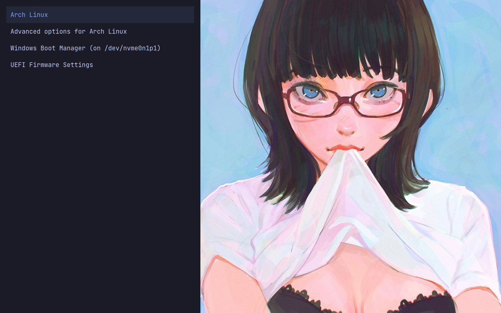
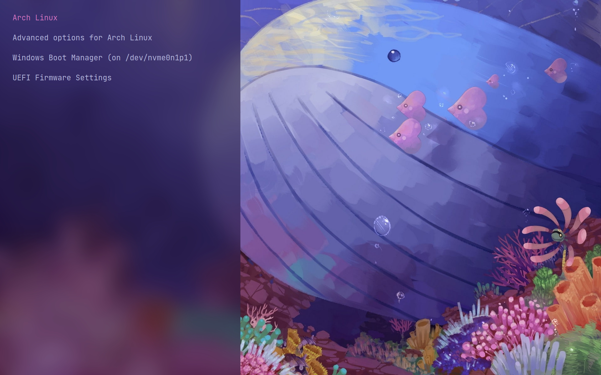
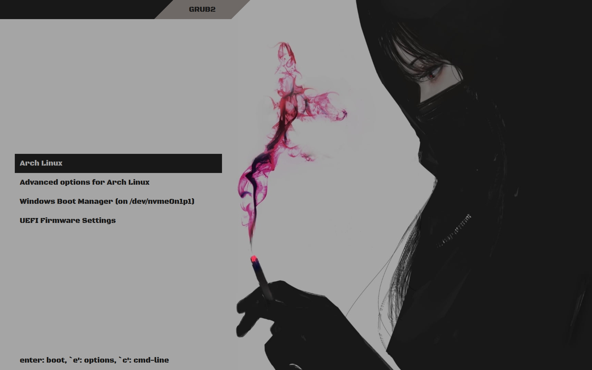

# Grub Themes

This is my attempt at creating simple Grub themes.

## Warning

All the themes are made for 1920x1200 screen resolutions. These may not work for other screen resolutions.

## Screenshots

### Blue Girl



### Cute Whale



### Pink Smoke



## Installation

- Clone this git repository and `cd` into it.

```bash
git clone https://github.com/nyxtales0x0/grub-themes.git
cd grub-themes/
```

- Make a `themes` directory under `/boot/grub/`.

```bash
sudo mkdir /boot/grub/themes
```

- Copy any theme folder of your choice to `/boot/grub/themes/`. For this example we will use `blue-girl` theme.

```bash
sudo cp -r blue-girl/ /boot/grub/themes/
```

- Open `/etc/default/grub` with a text editor and add the following line:

```
GRUB_THEME="/boot/grub/themes/blue-girl/theme.txt"
```

- Generate `grub.cfg` configuration file.
```bash
sudo grub-mkconfig -o /boot/grub/grub.cfg
```